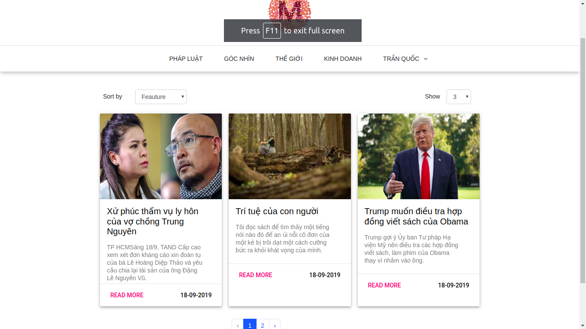
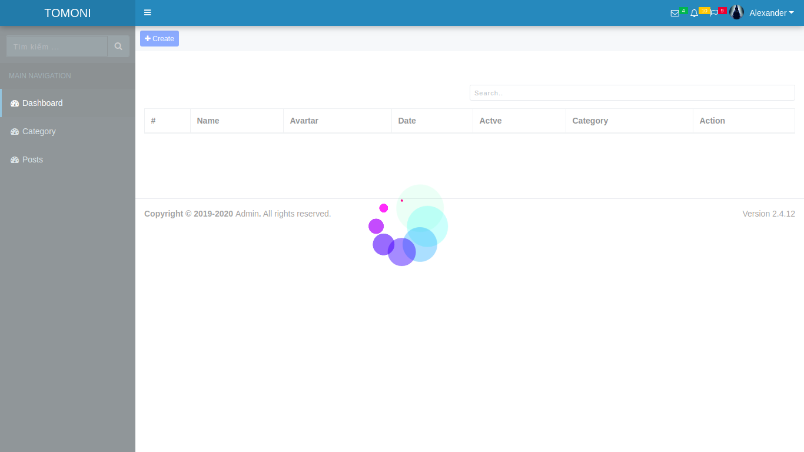

# blog-nodejs-server-angular8
# Nodejs back-end and Angular8 front-end

[Required Nodejs 10.6 and Angular 8 start project]
[Nodejs 10.x.x](https://nodejs.org) 

## Required
Nodejs 10.6
Angular 8
Apache MySQL

## Installation

- Clone the repository
    # Server
- cd nodejs-server-angular8-mysql
- npm i --save
- Import file blog.sql
- If you want Edit name database in blog-server->database->db.js
- npm start (start server)
- Port 4000
Then
    # Front end
- https://github.com/tranquoc113/angular8-nodejs-server-mysql.git
- cd angular8-nodejs-server-mysql
- npm i --save
- npm start 
- App will auto open to `http://localhost:4200/`. The app will automatically reload if you change any of the source files.
- Port 4200
- Page 

- Admin

## Contact
- Email:mydemoupdate@gmail.com - tranquoc631@gmail.com
- Telegram: +84 985 269 200
- fb: tranquocnumberoneupdate

